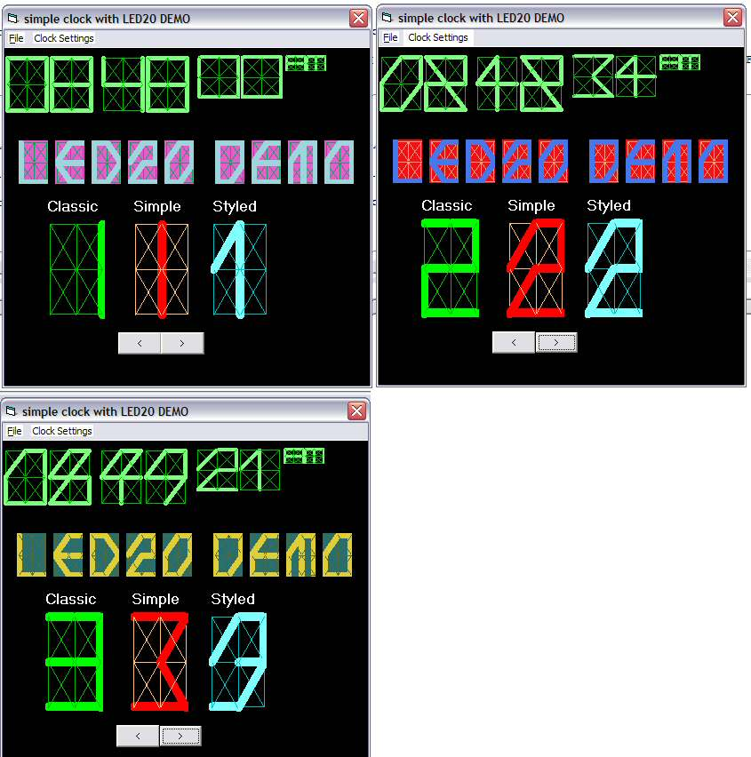



## LED \(20 Wire\) v2

### Description

A quickie LED UserControl.

LED20 because it uses 20 'Wires' to display characters (numbered 0 to 19 in case you're wondering)

'

NEW in V2

Changed Font consturction and display routines to use arrays

uses the Count property of Wire control array rather than hard coded values (Potentially allows you to add more Wires)

'

This is a spin off from the LED clock challange but definitely not a contender (way too many lines) but I was more interested in the LED than the clock.

If you look at the control in IDE you'll see that there has been no attempt to position the wires ahead of time.

In case you do want to edit it please note that the form has been locked to stop unnecessary fiddling about.

'
 
### More Info
 

             |
---                |---
**Submitted On**   |2005-01-21 18:44:02
**By**             |[Roger Gilchrist](https://github.com/Planet-Source-Code/PSCIndex/blob/master/ByAuthor/roger-gilchrist.md)
**Level**          |Intermediate
**User Rating**    |4.7 (28 globes from 6 users)
**Compatibility**  |VB 6\.0
**Category**       |[OLE/ COM/ DCOM/ Active\-X](https://github.com/Planet-Source-Code/PSCIndex/blob/master/ByCategory/ole-com-dcom-active-x__1-29.md)
**World**          |[Visual Basic](https://github.com/Planet-Source-Code/PSCIndex/blob/master/ByWorld/visual-basic.md)
**Archive File**   |[LED\_\(20\_Wi1842611212005\.zip](https://github.com/Planet-Source-Code/roger-gilchrist-led-20-wire-v2__1-58424/archive/master.zip)

